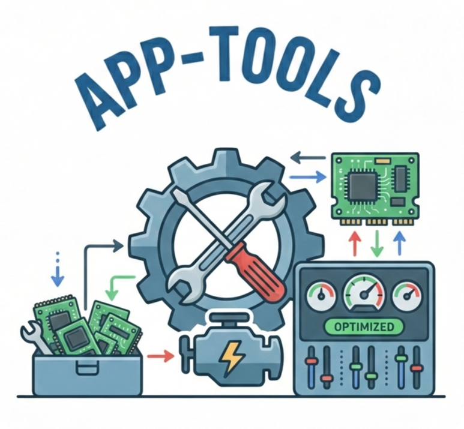

<div align="center">
  
</div>
<br>


# app-tools

A collection of tools for working with Apprentice, a program for tuning MC event generators (DOI: 10.1051/epjconf/202125103060, GitHub repository https://github.com/HEPonHPC/apprentice).
These additional tools provide functionalities such as improved grid generation, merging multiple newscan directories, and performing chi-squared analyses.

Several of the tools are specifically tailored to streamline the tuning of multiple event types within Apprentice, e.g. a combined tune on Drell-Yan and dijet data.

## Prerequisites

**Before installing this package, you must install:**

- **YODA >= 1.8.0**
- **Rivet >= 3.0.0**

You can follow these instructions: https://gitlab.com/hepcedar/rivetbootstrap

## Installation

```bash
git clone https://github.com/MoritzP2602/app-tools.git
cd app-tools
pip install .
```

## Requirements

This package automatically installs:
- numpy >= 1.19.0
- matplotlib >= 3.3.0
- tabulate >= 0.8.0

**Manual installation required:**
- YODA >= 1.8.0
- Rivet >= 3.0.0

## Tools

### Python Scripts:
- `app-tools-compute_chi2`: Compute chi2 from YODA files and write results to a JSON file.
- `app-tools-plot_chi2`: Plot chi2 data from a JSON file and generate an HTML report.
- `app-tools-create_grid`: Sample and create templates for parameter grid generation (improved version of `app-sample`).
- `app-tools-split_reweighting`: Split variations in YODA files in separate files.
- `app-tools-write_weights`: Extract observables from YODA file and write weights.
- `app-tools-combine_weights`: Scale and combine weights files.

- `app-tools-split_weights`: Split weight files into multiple files for parallel processing.
- `app-tools-merge_surrogates`: Merge multiple surrogate JSON files into a single file.

## Usage

Run the tools via the command line interface. To see all available options, usage instructions, and examples for each tool, use the `--help` flag:

```bash
<tool-name> --help
```

A detailed tutorial explaining how the tools can be used together with Apprentice is provided in the [Wiki](https://github.com/MoritzP2602/app-tools/wiki).

## Troubleshooting

### Verifying YODA and Rivet Installation

Before using this package, verify that YODA and Rivet are properly installed:

```bash
# Check YODA installation and version
python -c "import yoda; print(f'YODA version: {yoda.__version__}')"

# Check Rivet installation and version  
python -c "import rivet; print(f'Rivet version: {rivet.version()}')"
```

## License

MIT License
